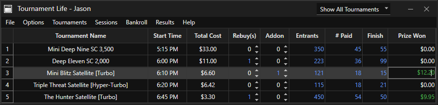
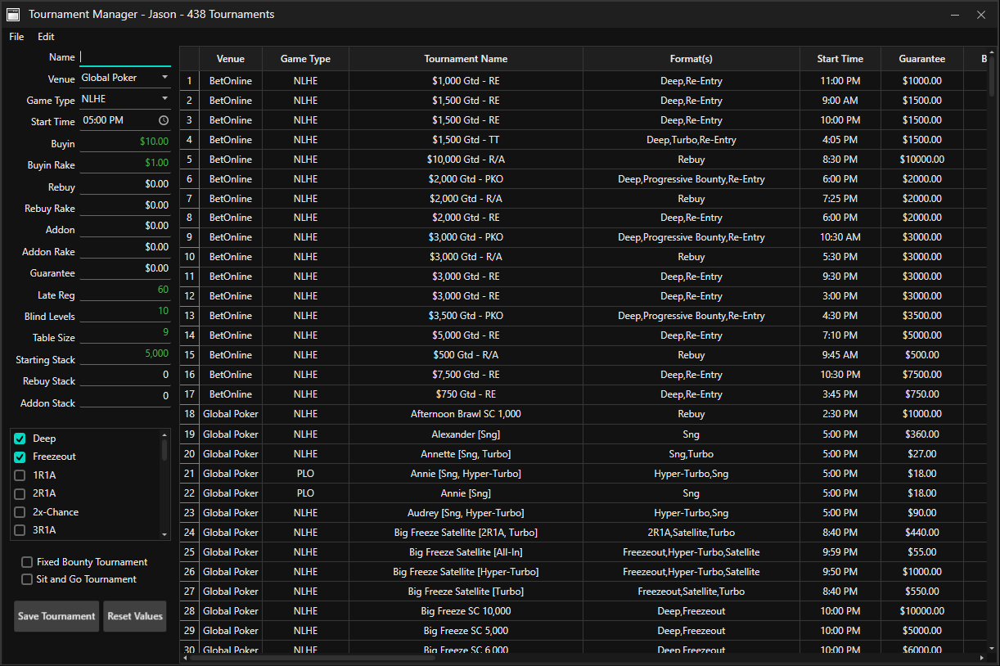
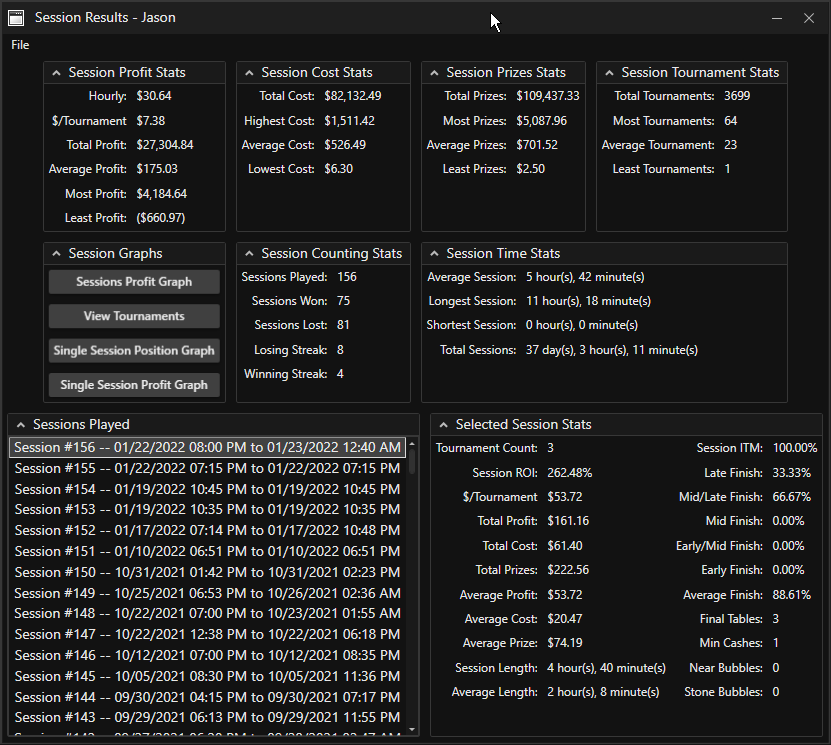
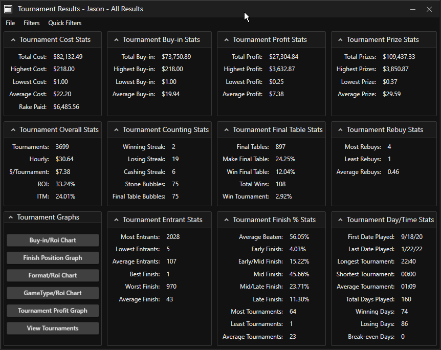
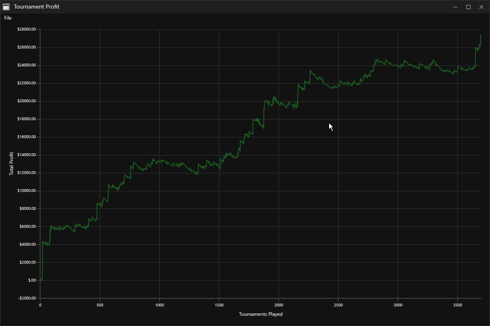
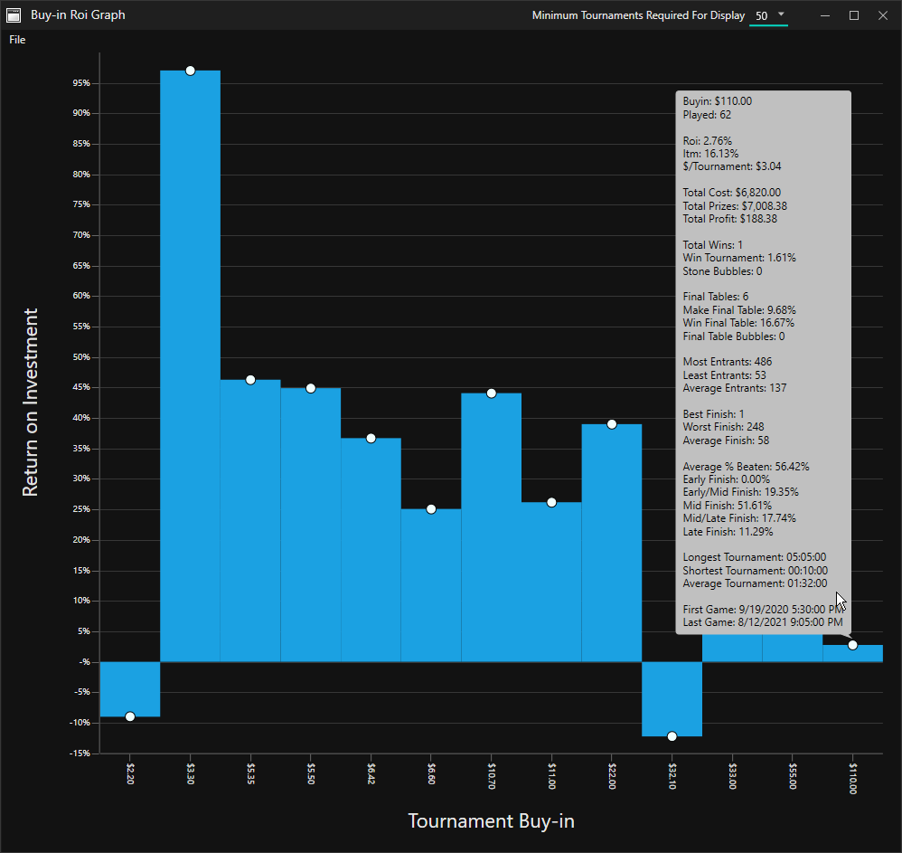

Tournament Life is a results tracker and analyzer for live/online poker tournaments. It was designed with ease of use and multitabling poker players in mind. You are free to use it to track as little or as much data as you would like about the poker tournaments you play. I will go over the various parts and featurs of the Tournament Life tracker below.
  

  
- TOURNAMENTS MENU
- Tournament Manager

 

 The Tournament Manager is where you can create/edit/copy/delete/import/export your tournament templates. You can import someone elses tournament templates file using the import option under the File menu. It will give the option to check for duplicates and also convert the starting times from the creators time zone to your time zone. Use the edit menu to add/remove/edit the venues, game types, formats and default values. The columns in the datagrid can be re-arranged to you liking and there is a right click context menu when you right click a tournament allowing you to copy/delete/edit and tag as favorites. Tournaments tagged as favorites will appear in the favorites menu under the Tournaments menu in the main tracker.
- SELECT TOURNAMENTS
 This is where you go to start tournaments from your list of tournaments. Hover over a tournament to get a pop-up showing all the template information for the tournament. There are some options for filtering/searching and some options under the options menu to control how the select tournaments window operates. 
- QUICK START TOURNAMENT
 Quick Start will open a window allowing you to create and start a tournament at the same time. It uses the default values from the Tournament Manager and gives you the option to start the tournament without or without saving it to the tournaments file. Tournaments not saved will not be able to be set as favorites or used as part of sessions. Any new Venues, GameTypes and Formats will be saved into the tournaments file. Options under the options menu control how the quick start window behaves.
- FAVORITE TOURNAMENTS
 This is where tournaments will appear when you tag them as a favorite. You can tag favorites in the tournament manager or in the right click context menu of any active tournament started in the tracker (excluding tournaments not saved as templates). Right click a favorite to remove it from the favorites list or load it into the tournament manager for editing/copying. You can also delete a tournament template from here.
 
 
 
- SESSIONS MENU
- SESSION MANAGER
 The Session Manager is where you go to create sessions out of your tournaments. Creating a session will allow you to start a full nights worth of tournaments with just a couple clicks. Created sessions will appear under the Sessions pop-out menu under Sessions. Only tournaments saved to the tournaments file will be available to use in sessions. 
- CREATE SESSION FROM RUNNING
 Launches the session manager window with all the currenty running (and saved to the tournaments file) tournaments already loaded in the session list.
- SESSIONS
 Created sessions will appear in a list here. Hover over an option to see the tournaments in that session. When a session is selected it will launch the session start window which will contain all the tournaments in the session. You have the option to remove tournaments from the list before starting ( this only stops them from starting with the session, it does not remove them from the saved session.

- BANKROLL MENU
- BANKROLLS
 The top option shows the total off all your bankrolls combined, A pop-out menu will show the bankroll breakdowns for each venue you have created a bankroll for. Hovering over the bankroll will show you the total deposits, withdrawals and bonuses associated with that bankroll
- NEW TRANSACTION
 use this option to launch the new transaction window where you can add a deposit, withdrawal or bonus to a bankroll
- VIEW TRANSACTIONS
 use this window to edit, delete and view the transactions associated with your bankrolls
- CREATE BANKROLL
 add a new bankroll to a venue to start tracking. The bankroll tracker will pull in all the results from any tournament that has that venue.
- DELETE BANKROLL
 deletes a bankroll, can't be undone
- RESULTS MENU
- RESULTS OVERVIEW 
 Shows a small simple window with the most popular tournament result statistics.
- SESSION RESULTS
 Show a full window of session specific stats. The list in the bottom left will show all the sessions you have played. As you complete tournaments off the main tracker this window will auto update and pull the newly finished tournaments into either an existing session or a new session depending. The sessions profit graph will show a profit/loss line graph with all the sessions your played on it. Hover over the adornment dots for a popup with all the info for that specific session. The view tournaments button will launch a record view of all the tournaments contained in the session selected in the sessions played list. You can add, delete and edit the info for any saved tournament from any session using this window. Consider using the database menu under the main file menu to back up your database before messing around too much with your saved records. The single session profit graph will show a pofit/loss line graph for just the session selected in the sessions played list. Hover over an adornment dot to see the specific info regarding that tournament. The color of the line graph for a proitable session (green) vs a losing session (red). The single session position graph will show a bar graph for all your finishing positions in the selected session. 
- TOURNAMENT RESULTS
 Shows a full window of tournament stats. Use the filter menu to create, edit, delete and load your own custom filters or use the quick filters for some common premade filters. The buy-in/roi, finish position graph, format/roi, gametype/roi graphs all show bar graphs of your roi against the various option. Tournament profit graph will show a line graph of your overall profit/loss. Adornment dots will appear for a graph with under 600 results but anything over that and it becomes too cluttered. You have the same options as the other graphs. You can zoom in and out with the mouse wheel and reset to the default zoom level with a double click. There is an option under the menu to save the graph as an image. The view tournaments shows record view of all the tournametns contained in the results. You can add, delete and edit the info for any saved tournament. Consider using the database menu under the main file menu to back up your database before messing around too much with your records.
- UNDO RECENTLY FINISHED
 Shows the 10 most recently saved tournaments. Selecting one will remove the record from your database and load the tournament back into the main tracker display. Hover over a recently finished tournament to see the data for that tournament.

 

- MAIN TRACKER WINDOW
 The heart of the software! Right click the header of any column to show/hide columns. Only the tournament name column is required to stay in view. You can also arrange the order of the columns however you like. You are not required to enter any data at all, the only thing that is required to finish a tournament is a name and a starting time that is before the ending time.
- RIGHT CLICK CONTEXT MENU
- FINISH TOURNAMENT
 this option will finish the selected tournament and save it to the database. If you have not manually updated the ending time of the tournament it will default to setting the ending time to your current time.
- STARTING TIME
 the top option will open a window for you to select any starting date and time that you want. By default tournaments will use the starting time set in the template and set the date to the current date. Sessions loaded in the afternoon/evening that have tournaments for after midnight will adjust and use the date from after midnight. Tournaments flagged as sng tournaments will use the current date and time from when they were started. The bottom option will set the starting time to the current time. This is useful for when you late reg a tournament and you just want to quickly update the starting time to the current time.
- ENDING TIME
 You can manually update the end time here but if you don't then when you finish a tournament the end time will be set to the current time. If you finished the tournament but don't want to remove it from the tracker right away then you would use one of the ending time options to set the end time manually. the top option will open a window for you to select any ending date and time that you want and the bottom option will set the ending time to the current time.

- TOURNAMENT DATA
- UPDATE TOURNAMENT DATA
 This will launch a window that allows you to update the template data for the selected tournament. You can update the data for just the tournament started and not change the template. You can have it update the running tournaments data and update the template file or your can have it update the running tournaments data and save the changes as a new tournament in the template file. This is useful for when a venue changes the tournament in some way.
- CREATE DUPLICATE TOURNAMENT
 This will launch a window with the selected tournaments data in it. This will start a copy of the selected tournament in the tracker. It has the option to save the new copy to the tournaments file or just start it as an unsaved one-off. Changes made here will never be reflected in the tournament template for the tournament we are copying.
- CANCEL
 Gives you various ways to cancel running tournaments. You can cancel the selected tournaments, select tournaments from a list to cancel or just cancel everything.
- SESSION
 Gives you some shortcuts for adding and removing tournaments from sessions without having to use the session manager. Remove from Sessions will only show sessions the tournament is a part of. Add to Sessions will show all the available sessions and it will flag the sessions that already contain the selected tournament.
- ADD/REMOVE FROM FAVORITES
 This will add or remove a tournament from the favorites menu. Only tournaments saved to the tournaments file can be added to the favorites list
- SCREENSHOT
 allows you to add or remove a screenshot from the tournament. Great for saving the screenshot of that big victory or brutal bad beat. You can also view the currently attached screenshot (if any)
- NOTES
 add any notes you want to the tournament record. Save important/big hand historys or any other info you want about the tournament.

 
 
 
